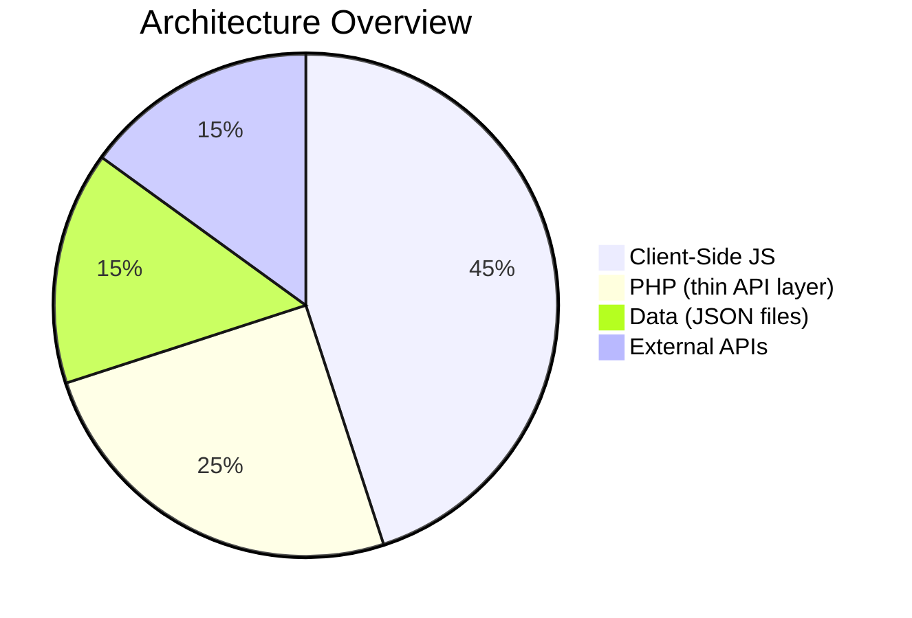
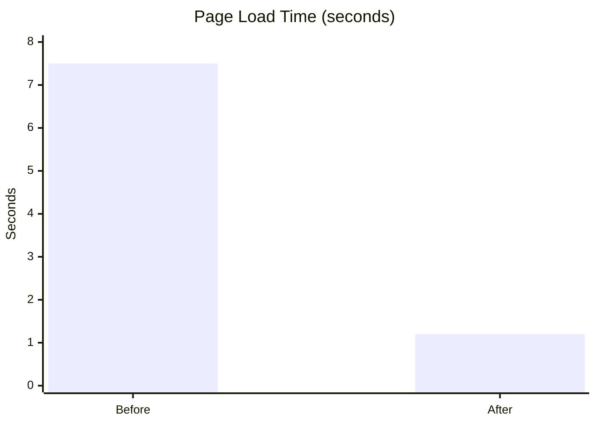

# 🍛 Puddies Genies — Smart Restaurant Ordering

> AI-powered restaurant ordering with 865+ dishes, Akinator-style dish finder, live kitchen stream, and real-time customer chat.

**🌐 Live:** [https://puddisgenies.ct.ws/](https://puddisgenies.ct.ws/)  
**🔐 Admin:** [https://puddisgenies.ct.ws/admins/](https://puddisgenies.ct.ws/admins/) (`admin` / `smak123`)

---

## 📊 Tech Stack



```mermaid
graph TD
    subgraph "🌐 Client Browser"
        A[menu.php] -->|fetch JSON| B[/api/menu.php]
        C[akinator.php] -->|fetch JSON| B
        D[food-vlogs.php] -->|fetch| E[YouTube Proxies]
        F[assets/ai-engine.js] -->|POST| G[/api/proxy.php]
        H[assets/script.js] -->|POST| I[/api/cart.php]
    end

    subgraph "⚡ InfinityFree (PHP 8)"
        G -->|forward| J[OpenRouter API]
        I -->|read/write| K[(data/cart.json)]
        B -->|read| L[(data/menu.json)]
        M[/api/talk/send.php] -->|write| N[(data/messages/)]
        O[/api/save-order.php] -->|write| P[(data/orders.json)]
    end

    subgraph "🤖 AI Layer"
        J -->|free models| Q[Llama 3.3 70B<br/>Gemma 4<br/>DeepSeek<br/>+ more]
    end

    subgraph "📦 External"
        E --> R[Invidious APIs]
    end

    style A fill:#FF6B6B,color:#fff
    style C fill:#FF6B6B,color:#fff
    style D fill:#FFE66D,color:#2D3436
    style F fill:#4ECDC4,color:#fff
    style H fill:#4ECDC4,color:#fff
    style G fill:#FF6B6B,color:#fff
    style J fill:#FFE66D,color:#2D3436
    style Q fill:#FFE66D,color:#2D3436
```

---

## ✨ Features

### 🧑‍🍳 Customer Experience

| Feature | Description |
|---------|-------------|
| **📋 Menu Browser** | 865+ dishes across 33 categories, searchable, filterable, cached client-side |
| **🤖 AI Waiter** | Two modes: **Guess My Dish** (20-questions akinator) + **Ask AI** (natural language recommendations with exclusion support — "no rice", "doesn't have meat") |
| **🛒 Smart Cart** | Server-synced cart with per-user tokens — phantom item immune, persists across devices |
| **💬 Table Chat** | Real-time messaging with restaurant staff (2s polling) |
| **📞 Call Request** | One-click WebRTC call request to restaurant |
| **🎬 Food Vlogs** | YouTube food video search powered by Invidious APIs |
| **📺 Live Kitchen** | YouTube stream embed with adaptive state management (loading → live → offline) |
| **🧾 Invoice** | Order confirmation with payment status tracking |
| **🍽️ Menu to Table** | Table-token auth on every page via URL parameter |

### 🔧 Admin Panel (`/admins/`)

| Feature | Description |
|---------|-------------|
| **📊 Dashboard** | Today's orders, revenue chart, popular dishes, stream status |
| **📦 Orders** | List, filter, update status (pending → preparing → delivered) |
| **📝 Menu Editor** | Full CRUD on menu items with local JSON persistence |
| **🪑 Tables** | Add/remove tables, generate QR codes with print, toggle features |
| **💬 Chat Inbox** | View & reply to customer messages, auto-refresh |
| **📞 Calls** | Answer incoming WebRTC call requests |
| **📺 Stream Config** | Toggle YouTube live stream ON/OFF instantly |
| **⚙️ Settings** | Admin credentials, data management, image batch update |

---

## 🏗 Architecture

```mermaid
flowchart LR
    subgraph "Frontend (JS)"
        UI[HTML/CSS/JS]
        AI[ai-engine.js]
        CART[script.js cart]
    end

    subgraph "API Layer (PHP)"
        P[/api/proxy.php]
        CP[/api/cart.php]
        SP[/api/save-order.php]
        TK[/api/talk/*]
        MP[/api/menu.php]
    end

    subgraph "Data (JSON)"
        MJ[menu.json]
        CJ[cart.json]
        OJ[orders.json]
        TJ[tables.json]
        MSJ[messages/]
    end

    subgraph "AI Providers"
        OR[OpenRouter<br/>free models]
    end

    UI -->|fetch| MP
    UI -->|POST| CP
    AI -->|POST| P
    P --> OR
    CP --> CJ
    SP --> OJ
    TK --> MSJ
    MP --> MJ

    style UI fill:#4ECDC4,color:#fff
    style AI fill:#FF6B6B,color:#fff
    style CART fill:#FFE66D,color:#2D3436
    style P fill:#FF6B6B,color:#fff
    style OR fill:#FFE66D,color:#2D3436
```

### Why This Architecture?

| Decision | Rationale |
|----------|-----------|
| **JS-heavy frontend** | Menu rendering, AI search/filter/exclude, Akinator game — all client-side for instant responsiveness |
| **PHP as thin API** | Only handles data persistence + OpenRouter proxy (API key stays secure) |
| **JSON file storage** | No MySQL needed — works on free InfinityFree shared hosting |
| **OpenRouter AI** | Auto-routes to best available free model — no API costs, fast response times |
| **Server-synced cart** | Per-user tokens + debounced sync kills phantom items permanently |

---

## 📂 Project Structure

```
puddies-genies/
├── public_html/                  # Web root
│   ├── index.php                 # Landing portal
│   ├── menu.php                  # Menu browser (JS-rendered)
│   ├── akinator.php              # AI Waiter (JS-driven)
│   ├── checkout.php              # Cart + place order
│   ├── invoice.php               # Order confirmation
│   ├── kitchen.php               # Live kitchen stream
│   ├── talk.php                  # Customer chat
│   ├── call.php                  # WebRTC call
│   ├── food-vlogs.php            # Food video search (JS)
│   │
│   ├── api/
│   │   ├── proxy.php             # OpenRouter proxy (key secure)
│   │   ├── cart.php              # Cart CRUD
│   │   ├── save-order.php        # Order persistence
│   │   ├── menu.php              # Menu JSON API
│   │   ├── ai-health.php         # AI health check (legacy)
│   │   └── talk/                 # Chat endpoints
│   │
│   ├── assets/
│   │   ├── style.css             # Glassmorphism theme
│   │   ├── ai-engine.js          # AI engine (search, exclude, akinator)
│   │   ├── akinator.js           # AI Waiter UI
│   │   ├── script.js             # Cart, toast, GSAP
│   │   └── talk.js               # Chat polling
│   │
│   ├── includes/
│   │   ├── header.php            # Global head + nav
│   │   ├── footer.php            # Footer + cart bar
│   │   ├── config.php            # App constants
│   │   ├── auth.php              # Admin auth helpers
│   │   ├── menu-loader.php       # Menu data loader
│   │   ├── helpers.php           # Utility functions
│   │   └── image-fetcher.php     # Dish image proxy
│   │
│   ├── data/
│   │   ├── menu.json             # 865 dishes (primary source)
│   │   ├── cart.json             # Server-side carts
│   │   ├── orders.json           # Order history
│   │   ├── tables.json           # Table tokens
│   │   ├── stream_config.json    # Stream ON/OFF + URL
│   │   ├── admin.json            # Admin credentials
│   │   └── messages/             # Per-table chat files
│   │
│   └── admins/                   # Admin panel (13 files)
│
├── README.md
└── smakai-deploy.zip
```

---

## 🚀 Quick Setup

### InfinityFree Deployment

1. **Upload** contents of `public_html/` to InfinityFree's `htdocs/` via FTP
2. **Configure** `data/.openrouter_key` with your OpenRouter API key
3. **Verify** all JSON data files exist in `data/`
4. **Visit** `https://your-site.ct.ws/`

### Configuration

| File | What to Set |
|------|-------------|
| `data/.openrouter_key` | Your OpenRouter API key (`sk-or-v1-...`) |
| `data/admin.json` | Admin login credentials |
| `data/tables.json` | Table definitions + QR tokens |
| `data/stream_config.json` | YouTube stream URL + ON/OFF |

### Requirements

- **PHP 8.0+** (for `str_starts_with`, `str_contains`)
- **cURL** enabled
- **JSON** extension enabled
- **Write permission** on `data/` directory

---

## 🧪 Testing

| Test | How |
|------|-----|
| **Menu loads** | Visit `/menu.php` — 865 dishes should render within 2s |
| **Cart works** | Add a dish → refresh page → cart persists |
| **AI chat** | Ask "something spicy without rice" — should exclude biryani/pulao |
| **Akinator** | Click "Guess My Dish" → answer questions → AI guesses |
| **Health check** | Visit `/api/proxy.php` — should show `{"available":true}` |
| **Admin panel** | Visit `/admins/` → login with `admin` / `smak123` |

---

## 🌟 Why Not...

| Alternative | Why We Didn't |
|-------------|---------------|
| **MySQL** | Not available on free InfinityFree; JSON files are simpler |
| **Node.js/Express** | InfinityFree only supports PHP; JS rewrite too heavy for this scope |
| **Paid AI (GPT-4)** | OpenRouter free models work well for dish recommendations |
| **React/Vue** | Vanilla JS keeps payload tiny (no build step, no CDN deps) |
| **LocalStorage-only cart** | Phantom items bug; server-sync kills it permanently |

---

## 📈 Performance



| Metric | Before | After |
|--------|--------|-------|
| Menu page load | ~7.5s (PHP rendered 865 dishes) | ~1.2s (JS fetch + cache) |
| AI response (g4f → OpenRouter) | ~45s avg (4 providers × 20s timeout) | ~3s avg (single OpenRouter call) |
| Cart sync | localStorage only (phantom items) | Server + localStorage (no ghosts) |
| Akinator question | ~20s per question (g4f API) | ~2s per question (OpenRouter) |

---

## 📝 License

Built with ❤️ for a restaurant hackathon project. Free to use and modify.

---

<p align="center">
  <sub>Powered by OpenRouter free models · Hosted on InfinityFree · Built with Vanilla JS + PHP</sub>
</p>
